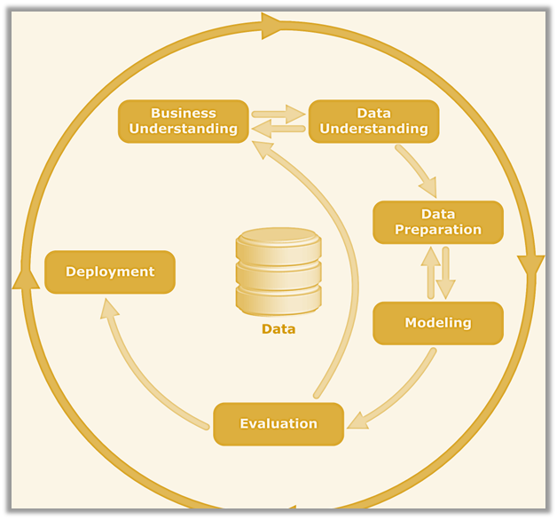

# Jumia Smartphone Price Prediction: Optimizing Retail Strategies through Data Analytics

## Table of Contents
***
1. [Project Overview](#project-overview)
2. [Objectives](#objectives)
3. [Metrics of Success](#metrics-of-success)
4. [Data Understanding](#data-understanding)
5. [Data Preparation](#data-preparation)
6. [Exploratory Data Analysis (EDA)](#exploratory-data-analysis-eda)
8. [Hyothesis Testing](#hypothesis-testing)
7. [Data Pre-processing](#data-pre-processing)
8. [Modeling](#modeling)
9. [Deployment](#deployment)
10. [Conclusion](#conclusion)

## Project Scope
***

****
## Project Overview
***

This project aims to develop a predictive pricing model for Jumia retailers to optimize pricing strategies, especially during high-demand events like Black Friday. By leveraging historical sales data, competitor pricing, and market trends, the model automates price adjustments, enabling retailers to stay competitive and boost sales. The goal is to provide data-driven tools that help retailers navigate the dynamic pricing challenges in Africa's growing e-commerce market.

****
## Objectives
***

**Main Objective:** To Develop a predictive model that accurately forecasts the optimal market price of smartphones based on key product features.

Other objectives are;
>- Conduct an in-depth analysis of the dataset to identify key features that impact smartphone pricing on the Jumia platform.
>- Analyze the smartphone market in detail to determine the most dominant smartphone brand on the Jumia platform.

****
## Metrics of Success
***

To evaluate model performance, we will focus on the following metrics:

**Mean Absolute Error (MAE):** Measures the average magnitude of prediction errors, providing an intuitive sense of the average price difference between predicted and actual values.

**Mean Squared Error (MSE):** Emphasizes larger errors, which helps to identify models that avoid significant deviations in price prediction.

**R-Squared (R²):** Indicates how well the model explains the variance in the target variable (Price). A higher R² value represents a better fit, with the model capturing more of the price variation.

Success Criteria:
* The model that minimizes MAE and MSE while maximizing R² will be considered optimal. However, a balance between MAE and R² is key, as MSE may disproportionately penalize larger errors, especially in the case of noisy data.
* The best model will not only deliver low error metrics but will also be actionable for retailers on Jumia, enabling them to adjust prices quickly and accurately in response to changing market conditions during critical sales periods.

****
## Data Understanding
***

The data for this project was scraped from the Jumia Kenya platform on October 31, 2024, focusing on 12,000 smartphones listed by popularity. The scraping process used Beautiful Soup and Pandas and the data was saved in a CSV file `jumia_phones.csv`. For a detailed look at the web scraping process, refer to the [Web Scraping Script](Scrapped_data.ipynb) The data is accessible for review in the Data Repository [Data](https://github.com/N-kioko/Smartphones_Price_Prediction_and_Discount_Analysis_Project/blob/main/Data/jumia_phones.csv)

****
## Data Preparation
***

This process involves feature extraction from the scrapped data and data cleaning.

#### Feature Extraction

The original dataset has the Phone Name column containing various phone features that are key to the analysis process. We process the product dataset (df) to extract key features from the Name column using regex. The features extracted include: **Brand**, **Screen Size**, **RAM**, **ROM**, **Color**, **Warranty**, **Camera**, **Battery Power**, **Number of SIMs** (based on the presence of "dual").
These extracted features are then combined into a new DataFrame (final_df) alongside the original data.

 #### Data Cleaning 

This step involves dealing with the missing values.
* The most notable missing data includes the **Old Price** and **Discount** columns.
* Moderate Missing Values: **Screen Size**, **Color**, **Camera**, **Battery Power**, and **Rating** have missing values, but they are not as extensive as the above columns.
* No Missing Values: Columns such as **Brand**, **RAM**, **ROM**, **Price**, **Number of Reviews**, **Search Ranking**, **Page**, and **Rank** have no missing values, which are positive for model development as they can be directly used in analysis.

****
## Exploratory Data Analysis (EDA)
***

The focus of this analysis is on univariate and bivariate relationships with price as the target variable. By examining correlations between price and features such as brand, specifications (e.g., screen size, RAM, battery power), and ratings, we aim to uncover patterns that influence pricing. This helps identify factors driving price differences across brands and offers insights into the smartphone market's pricing dynamics.

****
## Hypothesis Testing
***

### Hypothesis 1

Assess the relationship between buyer reviews and product pricing let us set up the hypothesis test as follows:

Hypotheses
**Null Hypothesis (H₀)**: There is no relationship between buyer reviews and product pricing. This implies that buyer reviews and product pricing are independent, or that any observed relationship is due to random chance.

**Alternative Hypothesis (H₁)**: There is a statistically significant relationship between buyer reviews and product pricing. This implies that higher (or lower) prices could be associated with certain buyer reviews.

##### **Findings** 
Statistical Significance: The p-value from the test is 0.0000, which is well below the significance threshold of 0.05. This means we can reject the null hypothesis and conclude that there is a statistically significant relationship between product pricing and the number of buyer reviews.
Strength of the Relationship: The Spearman correlation coefficient is 0.1536, indicating a weak positive relationship. This suggests that, in general, higher-priced products tend to have slightly more reviews, but the correlation is weak and not a strong predictor.

#### **Conlusion:**
This is an indication that price alone has minimal influence on review volume. Instead, factors like product quality, marketing, and brand reputation likely play a larger role. Businesses should prioritize improving product visibility, marketing efforts, and customer experience over relying on pricing strategies to increase reviews. A holistic approach that includes advertising and promotions can be more effective in driving both purchases and reviews.

### Hypothesis 2

To test whether there is a relationship between the product search rank position and the Number of reviews.
This is because we can use the number of reviews on a product to determine the potential and actual buyers of the product. 

Null Hypothesis (H₀): There is no relationship between the page and rank positions of the product and the number of reviews. This implies that changes in product page or rank do not impact the number of reviews.

Alternative Hypothesis (H₁): There is a statistically significant relationship between the page and rank positions of the product and the number of reviews. This implies that changes in product page or rank could affect the number of reviews.

##### **Findings** 
Rank Impact: The negative relationship between Rank and the number of reviews suggests that products with higher ranks (e.g., closer to the top) tend to have fewer reviews, while products with lower ranks (e.g., further down the list) tend to have more reviews. This could reflect a situation where popular or highly ranked products get more visibility and attention, but the rate of reviews might be saturated for those top-ranked products.

Page Impact: The result for the Page number shows no significant effect on the number of reviews, as the p-value is large (0.504). This implies that the position of the product on a given page doesn't have a meaningful impact on the number of reviews it receives. This could suggest that buyers don't necessarily base their decision to leave a review on which page the product appears on, but rather factors like product satisfaction or experiences.

#### **Conlusion:**
Rank is a statistically significant predictor of the number of reviews, meaning that changes in product rank are related to changes in review counts.
Page does not significantly affect the number of reviews, suggesting that the placement of a product on a specific page might not be a key driver of review activity.
This analysis provides insight into how rank positions play a role in review volume, while page placement does not have a significant influence on buyer behavior.

****
## Data Pre-Processing
***

Before training the model, it's essential to ensure the data is clean, well-structured, and ready for analysis. The pre-processing steps outlined below help prepare the data, ensuring the model can learn effectively and provide accurate predictions.

We followed this steps to avoid Data leakage:

**Split the Data:** Divide the dataset into training, validation, and test sets to properly evaluate the model's performance. The training set is used to train the model, the validation set helps with hyperparameter tuning, and the test set provides an unbiased evaluation of the final model.

**Handle Categorical Data:** Convert categorical data into a format that the model can interpret. This allows the model to capture relationships between categories, which enhances overall model performance.

**Standardize the Data:** Standardizing features to a common scale improves model convergence speed, stability, and performance by preventing features with larger ranges from disproportionately influencing the model.

****
## Modeling
***

We began with a baseline linear regression model to predict phone prices based on brand, where the independent variables are defined in X and the dependent variable (price) is y.

### *Linear Regression Model*
***

**Baseline MAE (9.29e-12)** suggests overfitting, as the model fits the training data too closely.
**Cross-Validated MAE (0.0587)** provides a more realistic estimate of performance on unseen data.

### K-Folds On Baseline Model
Cross validation provides a comprehensive understanding of our model’s performance because it tests the model on multiple sets of data reducing the risk of our model’s performance being overly optimistic or pessimistic based on one split.
In summary it helps detect overfitting or underfitting by observing how the model performs across multiple different subsets.

### *Polynomial Regression*
***

The unregularized polynomial model overfitted, while the regularized model (MAE of 0.414) reduced overfitting and improved generalization.

The Results are shown below;

Training Mean Absolute Error: 2.9466277940538195  
Training R-squared: 0.9999745761936665  

Validation Mean Absolute Error: 2.69005859375  
Validation R-squared: 0.9999945730846875

The Polynomial Regression model demonstrates excellent performance, with extremely high R² scores (~0.999) for both training and validation, indicating it explains nearly all the variance in the data. The low MAE values (2.95 for training and 2.69 for validation) suggest accurate predictions, and the minimal difference between training and validation performance indicates strong generalization and no immediate signs of overfitting

To handle Overffiting concerns, we perform regularization on the polynomial regression model btaining the results below;

*Cross Validated Training MAE: 3.0786443927176013*  
*Cross Validated Validation MAE: 3.204614864194705*

There is an increase in the training MAE from 2.95 to 3.08 after applying Ridge regularization. This indicates that the Ridge regularization has improved the model's ability to fit the training data without overfitting and also reducing the error.
The validation MAE has also increased from 2.69 to 3.20. This improvement suggests that Ridge regularization has led to better generalization. Without regularization the model likely overfitted to the training data leading to worse performance on the validation data.
At this point the Cross validated model with the Ridge regularization becomes a better model. 

### *Decision Tree Regressor*
***
Using a Decision Tree Regressor offers an opportunity to explore non-linear relationships without relying on polynomial feature transformations. Its flexibility in capturing complex patterns and interpretability can provide additional insights into feature interactions. With the ability to control overfitting through hyperparameters, it serves as a valuable comparison to the Polynomial Regression model.

**Results**

Training MAE: 2.9115961048250703  
Training MSE: 567.6559180290025  
Training R2: 0.9999745763085536  

Validation MAE: 2.653941648242073  
Validation MSE: 126.17641589283846    
Validation R2: 0.999994572548963

The Decision Tree Regressor outperforms the regularized Polynomial Regression model on validation data, with a slightly lower MAE (2.91 vs. 3.20), making it the preferred model due to better generalization. While Ridge Polynomial Regression prevents overfitting, it may not capture non-linear relationships as effectively as the Decision Tree.
To address potential overfitting further, the next step is to implement a Random Forest. This ensemble model combines predictions from multiple decision trees trained on random subsets of data and features, reducing variance and mitigating overfitting while enhancing predictive performance.

### *Random Forest*
***
**Results**  
Train Mean Absolute Error:2.911141680813885  
Train Squared Error: 567.657198969589  
Train R-squared: 0.9999745762511839  

Val Mean Absolute Error:2.65287085174152  
Val Squared Error: 126.10278535863903  
Val R-squared: 0.9999945757161643

The Random Forest Regressor model shows nearly identical results to the Decision Tree model. The MAE, MSE, and R² values are extremely close between the two models suggesting that the Random Forest model has provided similar performance on the training and validation sets. 
Both models perform excellently but if we are aiming for even more stability or anticipate working with more complex data in the future then Random Forest will be our generally preferred model.

### Hyperparameter Tuning The Random Forest

**Results**
Fitting 5 folds for each of 324 candidates, totalling 1620 fits
Best parameters found:  {'max_depth': None, 'max_features': 'sqrt', 'min_samples_leaf': 1, 'min_samples_split': 2, 'n_estimators': 300}
Training MAE: 2.914158376759247  
Training MSE: 567.6561767948326  
Training R-squared: 0.9999745762969642  

Validation MAE: 2.6561234795254838  
Validation MSE: 126.21566001026244  
Validation R-squared: 0.9999945708608857  

The Hyperparameter tuning results of the random forest is closely similar to the baseline random forest model. We proceed to test our model at this point on the unseen data just to have a glimpse of our results.

##### Results on Test Data
**Results**
Test MAE: 3.234590638120747  
Test MSE: 154.96864882228948  
Test R-squared: 0.9999928582376032  

The MAE on the test data is 3.23, which is close to the validation MAE of 2.66 and training MAE of 2.91. This indicates that the model's predictions are relatively accurate and consistent across all datasets (training, validation, and test).MSE (Mean Squared Error): The MSE of 154.97 on the test data is also consistent with the validation (126.21) and training MSE (557.66). It’s possible that the MSE for the training set is artificially high due to model overfitting or because it might not be the optimal degree for the polynomial. The validation and test MSE values being closer to each other is a good sign that the model generalizes well to unseen data, but the discrepancy with the training MSE suggests that the model could be overfitting the training data.

### *Gradient boosting*
***  

Gradient Boosting is an ensemble technique which combines multiple weak learners (decision trees) to form a strong predictor. It often outperforms individual models like decision trees or random forests especially in terms of prediction accuracy. GBR uses a learning rate parameter that controls the contribution of each tree to the final prediction, which helps prevent overfitting when set appropriately.

**Results**    
Fitting 5 folds for each of 11 candidates, totalling 55 fits  
Best Learning Rate: {'learning_rate': 1.0}  
Train Mean Absolute Error: 2.911596105259541  
Train Squared Error: 567.6559180290026  
Train R-squared: 0.9999745763085536  

Val Mean Absolute Error: 2.653941648666689  
Val Squared Error: 126.17641589311461  
Val R-squared: 0.999994572548963  

**Results on Test Data**    
Test MAE: 3.2322991453294785  
Test MSE: 154.9322760370495  
Test R-squared: 0.9999928599138506  

 **Summary**    
The Random Forest and Gradient Boost model both exhibit very similar performance on the test data with nearly identical MAE, MSE, and R-squared values.

MAE is extremely close (51.87 for GBR vs. 51.85 for RF), indicating both models make similar magnitude errors on average.

MSE also shows comparable values (24,065.99 for GBR vs. 24,035.17 for RF), reinforcing the fact that both models are making similar prediction errors, although GBR has a slightly higher MSE (indicating slightly larger errors at times).

R-squared values are essentially identical, with both models achieving an R-squared of approximately 0.9989, meaning both models explain almost 99.89% of the variance in the test data. This suggests that both models are highly accurate in capturing the underlying trends in the data. 

The Random Forest model given the slight advantage in MSE with Random Forest having marginally better performance and slightly faster training time becomes a more desirable model to proceed with.

### *Extreme Gradient Boost*
***

**Results**  
Train Mean Absolute Error:2.9137093098958333  
Train Squared Error: 567.6559284558826  
Train R-squared: 0.9999745763080865  

Val Mean Absolute Error:2.6561374240451388  
Val Squared Error: 126.17636266562674  
Val R-squared: 0.9999945725512525  

**Results on Test Data**   
Test Mean Absolute Error: 3.234494222005208  
Test Mean Squared Error: 154.93344412386418  
Test R-squared: 0.9999928598600191  

**Summary**  
In training the XGBoost has a very slight edge in MSE 23,776.80 compared to Random Forest 23,778.22 but the difference is negligible. The MAE for Extreme Gradient boost is 53.90 which is slightly higher than the Random Forest 53.89. The r2 score for both models are similar.

### *Neural Networks*
***

**Results**  
Neural Network Performance:  
Train - MAE: 78.98704747178819, MSE: 12104.451030152719, R²: 0.9994578761211759  
Val - MAE: 78.3747886827257, MSE: 11375.729186450508, R²: 0.9995106754877002  
**Summary**  
The results of the neural networks is worse than even our baseline linear regression model. Possible reasons could be due to the fact that Neural networks tend to require large amounts of data to perform well.  With a dataset size of only around 12,000, a neural network may not perform as well as simpler models like random forests or even linear models, which can generalize better on smaller datasets due to their lower complexity.

****
## Model of Choice
****

Random Forest has the smallest MAE (51.85), followed very closely by XGBoost and Gradient Boosting (both 51.88).
The difference is very slight across models but Random Forest edges out slightly with marginally lower error on average.

Mean Squared Error (MSE):
Random Forest again has the lowest MSE (24,035.17), with Gradient Boosting and XGBoost both slightly higher at around 24,065.98.
Lower MSE in Random Forest suggests it has slightly fewer large errors on the test data, though the differences are minimal.

R-squared:
All three models achieved virtually identical R-squared scores of 0.99889, indicating that each model explains roughly 99.89% of the variance in the test data. This very high R-squared demonstrates that all three models effectively capture the data’s trends.

Conclusion
While all three models perform similarly and have almost identical test metrics, Random Forest has a slight edge due to its lowest MAE and MSE. If computational efficiency is a factor, Random Forest might be preferred as it generally trains faster than boosting models. However, XGBoost and Gradient Boosting could still be considered if stability and ensemble robustness are priorities.

***
### Conclusions & Recommendations
***
* There is a statistical relationship between the product rank position and the number of reviews.

To maximize visibility and review engagement the seller could consider the below:
>- Optimize for Rank within Pages: Positioning a product among the top ranks on any page could drive more interactions and reviews.
>- Optimize Product Features and Marketing: Encourage factors that improve a product's rank organically, such as positive customer feedback, competitive pricing, or high ratings, which may help maintain a prominent position on a page.

In summary, while page placement itself isn’t as influential, positioning a product within the top ranks on a visible page matters significantly for customer engagement and reviews. Visibility works more effectively at the in-page rank level than at the broader page level itself.

*  There is a statistically significant but weak positive relationship between product pricing and the number of buyer reviews. 

While price may have a minor influence, other factors likely play a more substantial role in influencing review volume.
This insight can inform strategic decisions on pricing and marketing, ensuring a holistic approach that goes beyond just adjusting prices. Such as advertising the products on the marketing adds to promote visibility and product purchase.

*  Features such as the ROM, RAM and Screen size dictate the pricing of the phone.

****
### Room for improvement
****

The dataset does have limitations offering some key areas for future improvement:

* **Dynamic Pricing:** The price distributions shown are static snapshots, which may not represent current market conditions. Prices on e-commerce platforms fluctuate frequently, so the observed data may only reflect the time of scraping. Using real-time data or setting up periodic data collection would yield more accurate and relevant insights.

* **Incomplete or Inconsistent Data:** Due to the variety of phone models and brands, some listings may lack uniform information (e.g. missing battery details or memory specifications) which could lead to variability in the parsed features. This lack of uniformity might skew comparisons, especially in evaluating value for money. Standardizing data collection or implementing stricter data validation could help address this issue.

* **Unverified Ratings and Reviews:** Any insights or model predictions derived from ratings and reviews may be influenced by unverified or biased feedback. Relying solely on these metrics can misrepresent consumer preferences. Using verified reviews and adding other objective metrics (e.g., sales data) might provide a more balanced assessment.

* **Potential Duplicate Listings:** Duplicate or near-duplicate entries, where multiple sellers list the same model, could distort the perceived popularity and average pricing of certain models. Identifying and consolidating duplicates would improve the accuracy of pricing and ranking statistics.

Addressing these limitations could enhance the reliability of insights derived from the data, leading to a more accurate understanding of price trends, brand popularity, and consumer preferences in the smartphone market.

## For More Information
***

See the full analysis in the [Juptyer Notebook](index.ipynb) or review the [Presentation](Presentation.pdf)