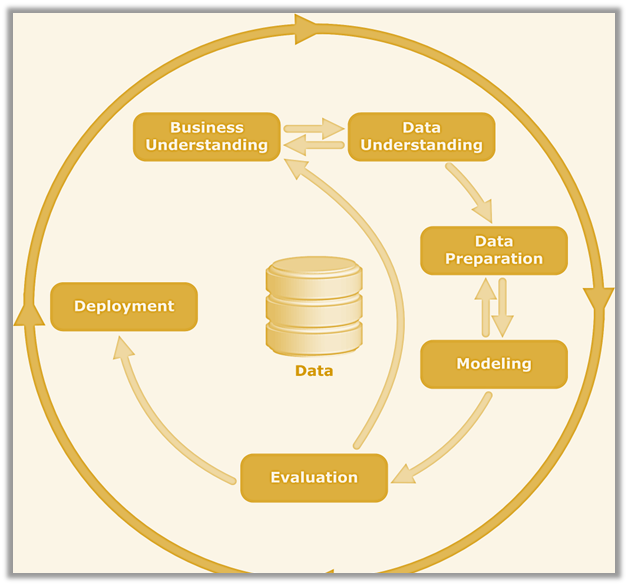

# Jumia Smartphone Price Prediction: Optimizing Retail Strategies through Data Analytics

# Project Overview

This project aims to create a predictive pricing model for Jumia retailers to optimize pricing strategies, particularly during high-demand periods like Black Friday. By using historical sales data, competitor pricing, and market trends, the model will automate price adjustments, helping retailers remain competitive and improve sales performance. The goal is to provide data-driven tools that empower retailers to navigate dynamic pricing challenges in Africa's rapidly growing e-commerce market.

# Objectives

>- Build a predictive model that uses historical sales data, competitor pricing and market trends to forecast optimal   pricing for smartphone products during high-traffic sales events such as Black Friday.
>- Analyze historical sales and pricing data to identify key factors that drive consumer purchasing decisions and pricing trends.

# Data Understanding

The data for this project was scraped from the Jumia Kenya platform on October 31, 2024, focusing on 12,000 smartphones listed by popularity. The scraping process used Beautiful Soup and Pandas and the data was saved in a CSV file `jumia_phones.csv`. For a detailed look at the web scraping process, refer to the [Web Scraping Script](Scrapped_data.ipynb) The data is accessible for review in the Data Repository [Data](https://github.com/N-kioko/Smartphones_Price_Prediction_and_Discount_Analysis_Project/blob/main/Data/jumia_phones.csv)

# Architecture

